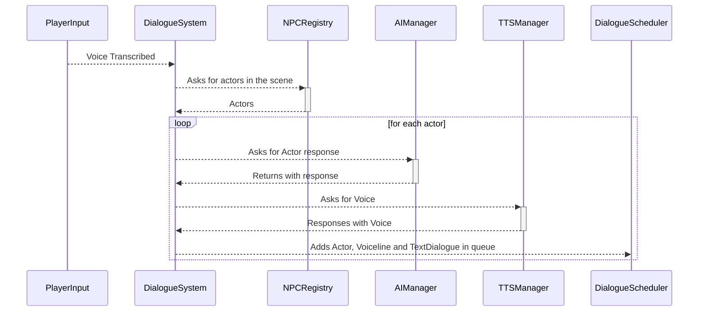
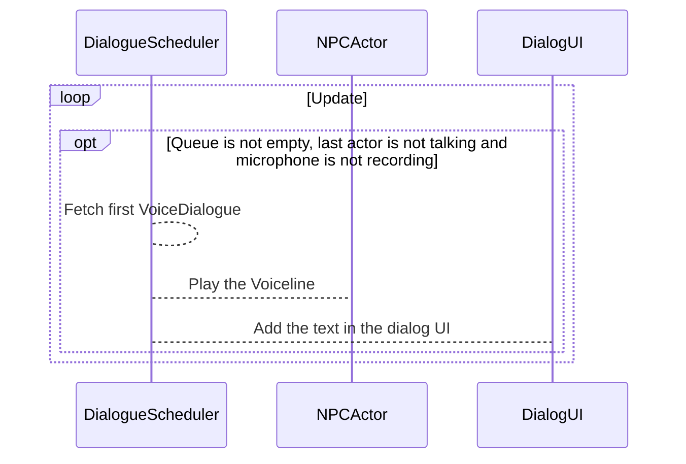

# Diagrams

## Sequence Diagrams

### Dialogue System

```mermaid
sequenceDiagram
    
    PlayerInput -->> DialogueSystem: Voice Transcribed
    DialogueSystem -->>+ NPCRegistry: Asks for actors in the scene
    NPCRegistry -->>- DialogueSystem: Actors
    loop for each actor
        DialogueSystem -->>+ AIManager: Asks for Actor response  
        AIManager-->>- DialogueSystem: Returns with response
        DialogueSystem-->>+TTSManager: Asks for Voice  
        TTSManager -->>-DialogueSystem: Responses with Voice
        DialogueSystem -->> DialogueScheduler: Adds Actor, Voiceline and TextDialogue in queue
    end
```

### Dialogue Scheduler

```mermaid
sequenceDiagram
    loop Update
        opt Queue is not empty, last actor is not talking and microphone is not recording
            DialogueScheduler --> DialogueScheduler: Fetch first VoiceDialogue 
            DialogueScheduler --> NPCActor: Play the Voiceline
            DialogueScheduler --> DialogUI: Add the text in the dialog UI
        end

    end
```

### Setup Scene Diagram
```mermaid
sequenceDiagram


```


## Dependency Diagram
```mermaid

```